# 狂人困局

**——贝尔萨的第三次世界杯，重复了他24年前做过的同一个梦**

 

## 引子

2026年6月22日，迈阿密硬石体育场，第61分钟。

乌拉圭2比1领先佛得角，一切在轨道上。半场逆转证明贝尔萨的中场调整奏效了。看台上的天蓝色在佛罗里达的阳光里晃动，像一片终于安静下来的海。

然后穆斯莱拉冲出去了。

这是一个40岁的门将对一颗直塞球的判断。他跑出禁区，左脚迈出，身体重心下沉——然后发现自己到不了。他没有碰到皮球。佛得角替补瓦雷拉跑过他身边，面前的空门大得像一整个墨西哥湾。

2比2。穆斯莱拉跪在地上，双手撑住草皮，没有抬头。

> **[图1]** 穆斯莱拉出击失误后跪地。来源：头条体育，乌拉圭vs佛得角赛后，2026年6月22日

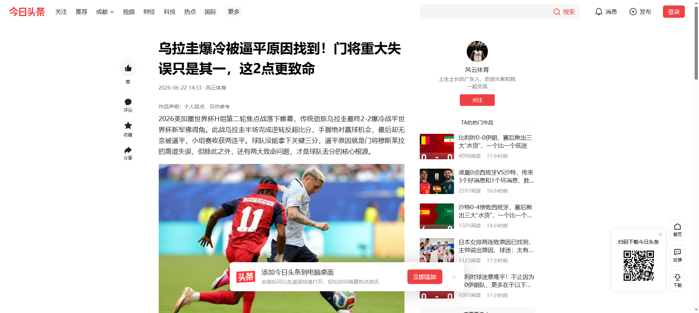

乌拉圭球迷席一片死寂。

这不是第一次。24年前在宫城，14年前在约翰内斯堡，他们在不同的看台上，穿着不同的球衣，穿着不同的蓝色，看过同一个剧本。一个70岁的老人站在场边——起立，踱步，蹲下，再起立。

贝尔萨的姿势没变。困住他的东西也从来没变过。

而这一次，没有下一次了。

## 第一章：三次世界杯，一道从来没有愈合的伤口

先回到1998年。

那年贝尔萨接手的阿根廷，刚从帕萨雷拉时代走出来。帕萨雷拉的团队把长发禁令执行得比战术纪律还严，巴蒂斯图塔得剪头发、雷东多直接退出国家队。一支精神内耗严重的球队交到了贝尔萨手上。

贝尔萨干的第一件事是战术革命。他带来了那套后来成为传说的3-3-1-3——三个中卫，一个后腰，两个翼卫，一个前腰，三个前锋。在战术板上画出这个阵型，像一个指向对手球门的箭头，锐利、单薄、毫无保留。

**2002年世界杯预选赛，阿根廷用这个阵型打了18场，13胜4平1负。** 这是一个什么概念？（下图是贝尔萨3-3-1-3阵型的手绘战术板，含全部球员站位和中场真空带标注）

> **[图3]** 贝尔萨3-3-1-3阵型示意图 — 阿根廷2002。单前腰Verón为创造力核心，一旦被冻结全军瘫痪。

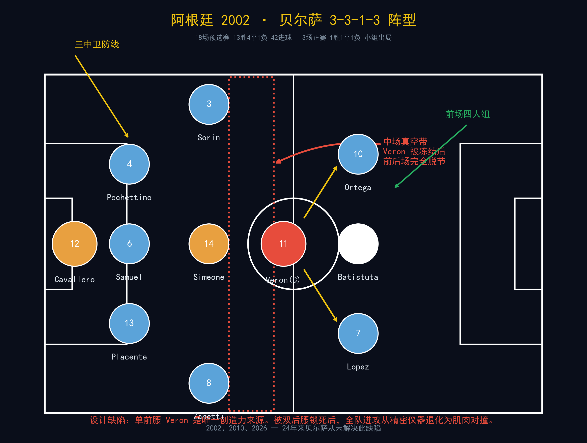

他们拿到了54分里的43分，比第二名厄瓜多尔多了12分，提前四轮出线。42个进球，只丢了15个。那支阿根廷在预选赛的统治力，用后来的标准衡量——堪比2010年的西班牙在正赛，或者2018年的法国在淘汰赛。

新浪体育后来的长文回忆过那段日子："在预选赛中一骑绝尘的阿根廷让全世界的对手胆寒。"FIFA官方在2026年的回顾文章里用的词更直接：他们是"one of the favourites to lift the coveted crown"——夺冠最大热门之一。

然后正赛开始了。

首战尼日利亚，1比0。全场31脚射门，只进了一个，来自巴蒂斯图塔的角球头球。问题还没暴露。次战英格兰，0比1，贝克汉姆的点球。贝尔萨拒绝让巴蒂和克雷斯波同时上场——两个当世最好的中锋，他只要一个。贝隆延续了在曼联的低迷，3-3-1-3的单前腰体系一旦哑火，整个中场就变成一条空走廊。

末战瑞典。生死局。阿根廷需要一个进球。上半场他们从边路狂攻，瑞典几乎没有一次进攻——当时的解说词是："看一百场甚至一千场比赛，也很难看到这样一种情形的上半场。"但你能猜到结局：1比1。阿根廷小组第三，回家。

赛后巴蒂斯图塔蹲在草坪上，双手捂脸。那个画面传遍了全世界。

> **[图2]** 巴蒂斯图塔2002世界杯小组出局后掩面痛哭。来源：搜狐体育，世界杯10大悲情时刻

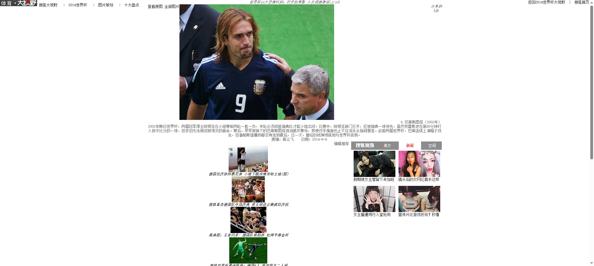

那不是一次"爆冷"。那是贝尔萨体系的通用解法被发现后的必然结果。These Football Times在2015年的长文里精准地拆解过：贝尔萨的3-3-1-3在预选赛中横扫南美，因为对手还试图对攻；到了正赛遇到英格兰和瑞典的铁桶阵，单前腰被双后腰锁死，边路传中无人终结，"他坚持使用一个中锋和一个前腰，拒绝让两个天才同时出现在攻击区域"。

这是一个用预选赛统治力推导正赛实力的致命逻辑错误——而贝尔萨此后24年都在重复这个错误。

**智利时代**（2007-2011）是唯一一次看起来像"例外"的经历。

2010年南非世界杯，贝尔萨的智利从小组赛出线。这是智利自1998年以来首次进入淘汰赛，也是贝尔萨世界杯执教生涯的最好成绩。

> **[图4]** 2010世界杯，贝尔萨在场边指挥智利队。他标志性的蹲姿/踱步姿势从那时起就再没变过。来源：UOL Copa do Mundo，2010年6月

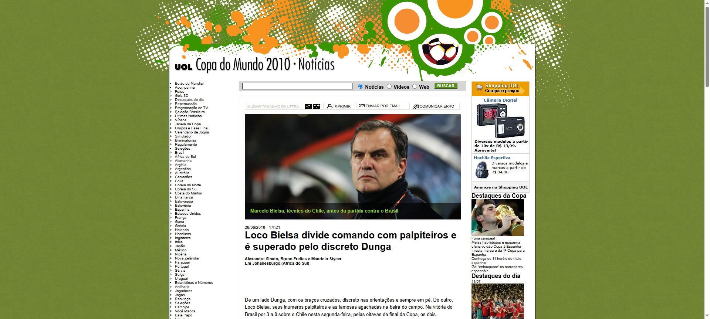

El País Uruguay在2026年6月的回顾文章给这段经历的定义是"cambio cultural"——文化变革。贝尔萨在智利留下的，不只是成绩，是一整套被后来人称为"Bielsismo"的足球基因：桑切斯、比达尔、梅德尔这批球员至今把个人发展归功于他。

但这不算真正的"突破"。智利的成功有三个不可复制的条件：分组有利（洪都拉斯和瑞士是那个小组的软柿子）、球队年轻体能充沛没有任何荣誉包袱、淘汰赛遇到巴西立刻原形毕露。它是贝尔萨体系的天花板的精确坐标：能过小组赛，但跨不过真正的强队。

**然后是乌拉圭。**

> **[图5]** 贝尔萨执掌乌拉圭，2023年5月上任。他接手后连胜巴西、阿根廷，制造了巨大的"统治幻觉"。来源：ESPN，2026年6月

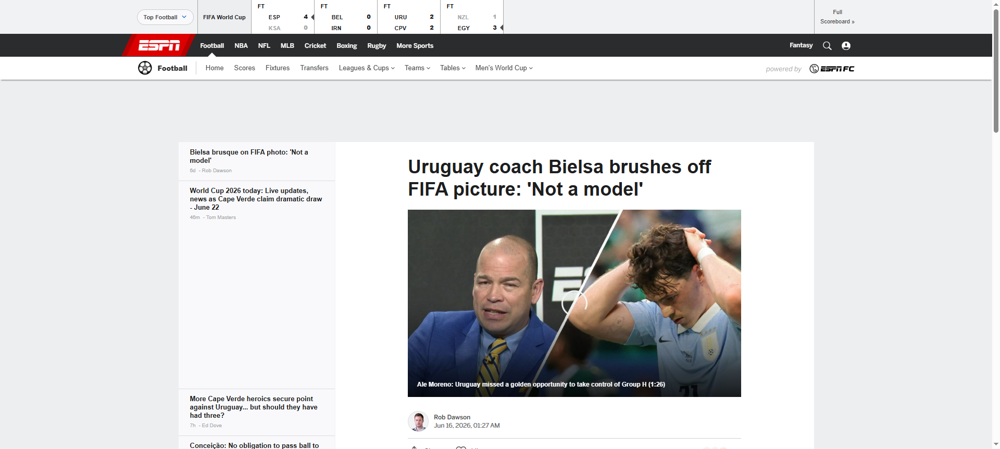

2023年5月，贝尔萨接手时，乌拉圭刚刚从卡塔尔的小组赛出局中走出来。苏亚雷斯、卡瓦尼、戈丁的黄金一代正在谢幕。这本该是一个重建周期，但贝尔萨没有"过渡"这个概念。他一上来就赢了前三场，然后连胜巴西2比0——这是乌拉圭22年来首次在正式比赛中击败巴西——再在糖果盒球场2比0赢下阿根廷，那是阿根廷在2022世界杯夺冠后的首场失利。

舆论疯狂了。

没有人注意到一个数字：在那6场开局之后，乌拉圭在预选赛最后12场比赛里只进了9个球，场均0.75，9场丢分。SI的乌拉圭前瞻文章用了一句非常冷静的总结：**"Uruguay looked very strong early on in qualifying... Then the team imploded, dropping points in nine of its last 12 games."**

> **[截图6]** Sports Illustrated阵容前瞻。作者 Amanda Langell，2026年5月14日

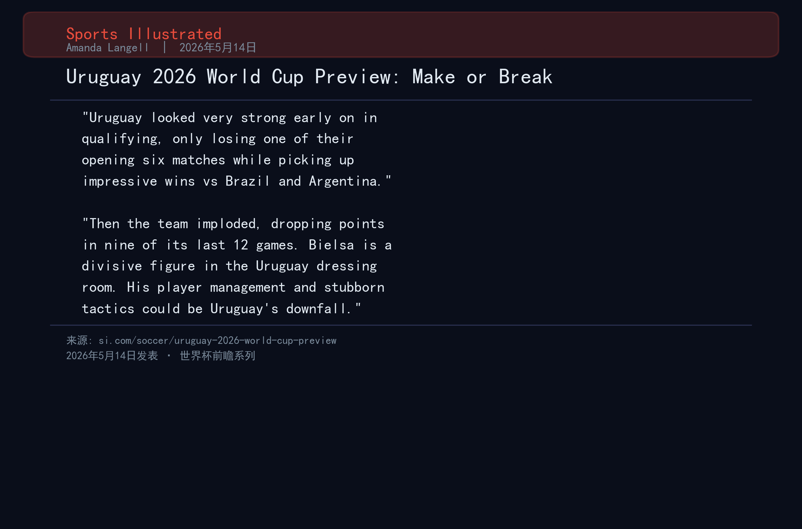

崩塌在正赛之前就开始了。只是人们选择不去看。

## 第二章：两场平局的解剖

> **[图6]** 乌拉圭两场核心战术指标对比。数据来源：SportMonks

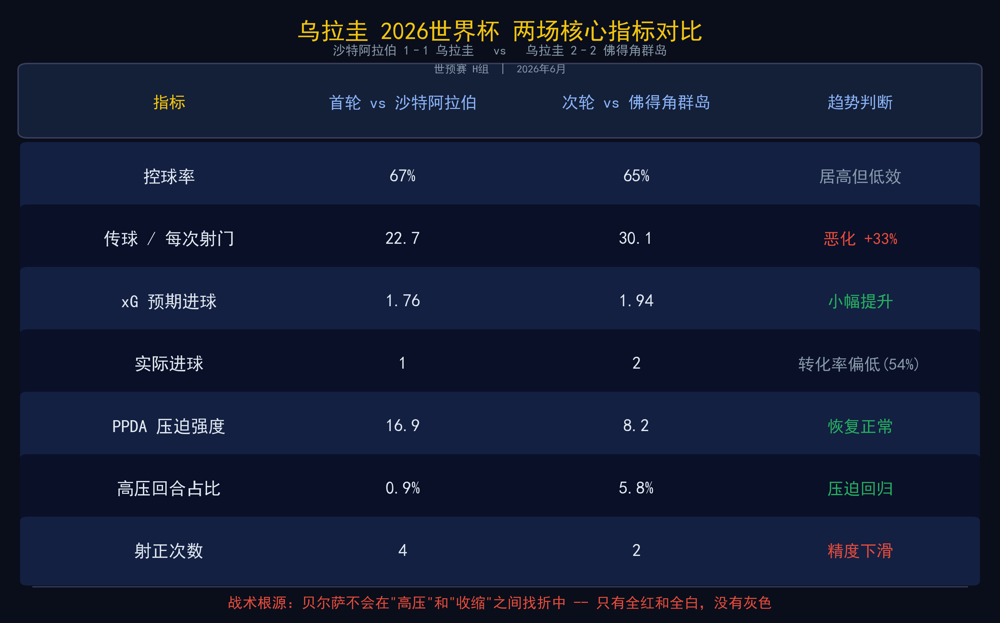

到现在为止，乌拉圭2026年世界杯小组赛的数据如下。

### 第一场：沙特阿拉伯1-1乌拉圭

乌拉圭控球率67%，传球612次——这个数字在世界杯历史上都排得上号。但**PPDA只有16.9**。对不熟悉这个指标的读者简单解释一下：PPDA（Passes Per Defensive Action）是衡量压迫强度的指标，数字越低意味着压迫越凶。2024年英超冠军曼城的PPDA通常在8左右。16.9意味着乌拉圭几乎放弃了系统性压迫——一支贝尔萨的球队，不压迫了。

压缩进攻是什么效果？**每22.7次传球才换一次射门**。xG是1.76，实际进球1个。转化率57%。

Squawka的赛后战术分析标题直接用了"'3-0-7' deceives to flatter"。

> **[截图1]** Squawka赛后战术分析引用。来源：squawka.com，作者 Connor Holden，2026年6月16日

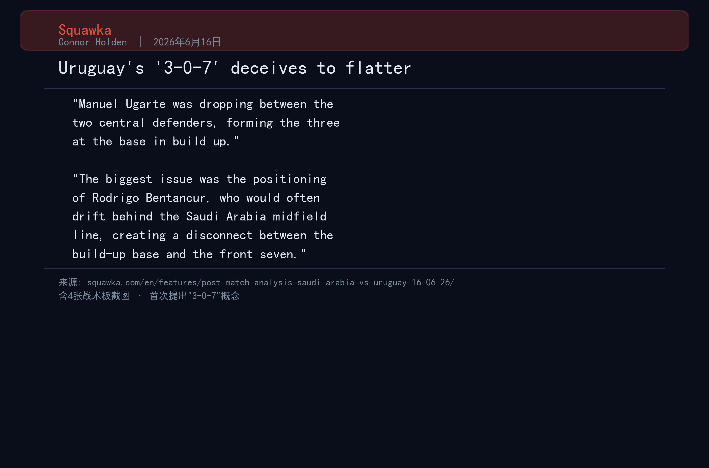

配套战术板图解：

| 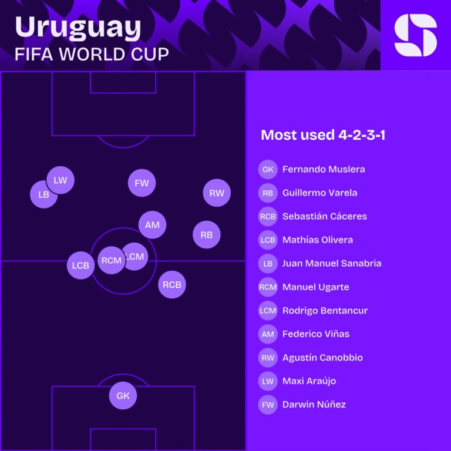 | 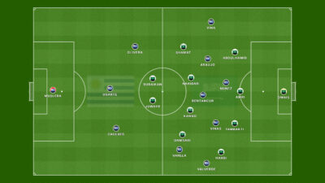 | 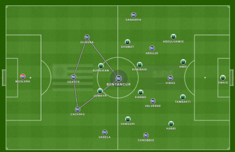 |
|:--:|:--:|:--:|
| 乌加特后撤形成三人底座 | 本坦库尔消失在中场线后 | 下半场调整后阵型 |

他们在文章里详细描述了贝尔萨的阵型如何变成了一个灾难：乌加特后撤到双中卫之间形成三人出球底座，两个边后卫推上高位，本坦库尔"often drift behind the Saudi Arabia midfield line"——也就是说本坦库尔跑到了沙特中场线的后面，直接消失在了对手的防守结构中。结果就是后场的三人底座和前场的七个人之间，出现了一个接近30米的"真空带"。这就是3-0-7中那个"0"的含义。SportsMole的赛后标题更直白：**"Bielsa hits familiar stumbling block"**。

> **[截图2]** SportsMole赛后报道原文。来源：sportsmole.co.uk，作者 Alexis Pereira，2026年6月16日

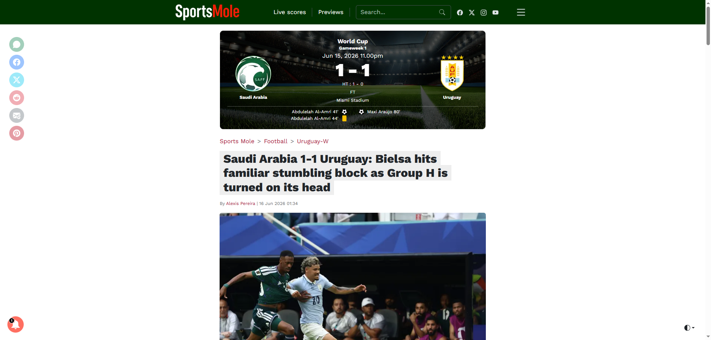

如果你觉得这听起来耳熟——它就是2002年阿根廷对瑞典的翻版，只不过那一次真空的是贝隆，这一次真空的是本坦库尔和德阿拉斯卡埃塔。

### 第二场：乌拉圭2-2佛得角

贝尔萨做了调整。他让球队收回来。PPDA升到了8.2，总算在正常水平了。但收缩的代价是什么？传球/射门比从22.7恶化到了**30.1**。你以为第一场已经够低效了，第二场告诉你什么叫底还在下面。

xG是1.94，实际进了2个——看起来效率回来了。但那是因为第44分钟和第45+5分钟的连续进球。剔除这2分钟的爆发，乌拉圭在剩下88分钟里没有制造任何真正的威胁。而且第61分钟，穆斯莱拉送出了那个空门。

搜狐体育赛后文章用的定性是"两连平深陷泥潭"。这个标题不算夸张。乌拉圭全场只有7脚射门，2次射正。一次来自定位球，一次来自补时阶段的边路传中。运动战的有效进攻，约等于零。

头条体育的赛后分析指出贝尔萨**"直到70分钟才换人"**。对手佛得角的边路进攻在第55分钟左右已经明显压制了乌拉圭的右路，但贝尔萨的换人牌像被焊在了教练席上。替补席上坐着罗德里格斯、佩利斯特里这样的速度型边路攻击手，全场枯坐。

> **[截图5]** 头条体育赛后发布会实录：贝尔萨揽责+三大失误坦承。2026年6月22日

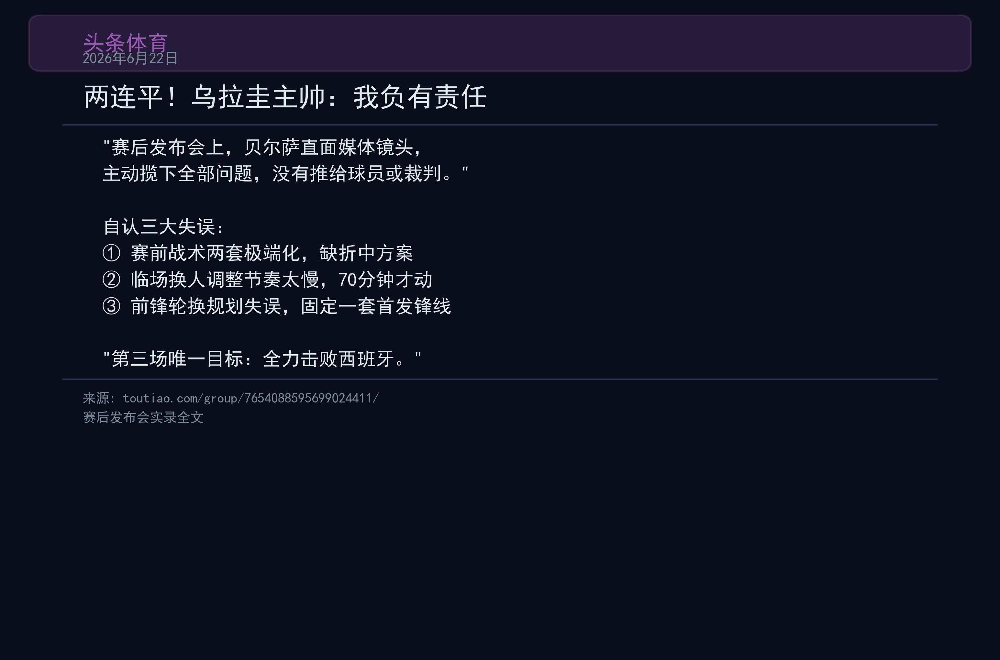

### 两张比赛的数据并排看，问题一目了然：

| 维度 | 首轮vs沙特 | 次轮vs佛得角 | 趋势 |
|------|:---:|:---:|:---:|
| 控球率 | 67% | 65% | 持续压倒但无效 |
| 传球/每次射门 | 22.7 | 30.1 | **恶化33%** |
| xG | 1.76 | 1.94 | 创造机会不差 |
| 实际进球 | 1 | 2 | 转化率仅54% |
| PPDA | 16.9 | 8.2 | 从完全放弃到正常 |
| 高位压迫比 | 0.009 | 0.058 | 终于开始压迫了 |

两场平局的背后，是同一个病因的两面症状：贝尔萨不会在"高压"和"收缩"之间找到一个折中点。他的战术光谱只有两个颜色——全红和全白，没有灰色。

## 第三章：困局的五重密码

如果你在搜索引擎里输入"Bielsa collapse pattern World Cup"，你会发现这不是我一个人的推论。过去二十多年里，英文媒体和中文媒体都有大量文章讨论过这个问题。把它们叠起来看，五条因果链浮出水面。

### 密码一：预选赛和正赛是两种足球，贝尔萨似乎只擅长前者

预选赛是马拉松：18场比赛分布在两年里，对手从巴西到玻利维亚高原都有，有来有回，有时间修正。正赛是短跑：三场小组赛在九天之内打完，对手研究你三个月，每场都是生死战，没有容错空间。

贝尔萨的战术需要时间——他需要让球员在高强度训练中形成肌肉记忆，需要在多场比赛中调试阵型的细节。这在预选赛中管用。到了正赛，对手的三位分析师已经把你们过去12场比赛的录像翻烂了。SI的文章提到乌拉圭后12场预选赛"averaging just 0.75 goals per game"，但这不是"状态下滑"，这是对手从录像里找到了贝尔萨的命门，然后每个人都用同样的方法打你。

### 密码二：创造力单点脆弱性，一个玩了24年还没改的设计缺陷

贝尔萨的体系只需要一个创造力核心。2002年是贝隆。2026年是德阿拉斯卡埃塔。这个设计的脆弱性在于：只要这一个核心被冻结，全队的进攻就从精密仪器退化成肌肉对撞。

贝隆在2002年延续了他在曼联的低迷，阿根廷三场只进2球，没有一个运动战进球。德阿拉斯卡埃塔受伤后，乌拉圭的传球/射门比从平时20左右飙到了30.1——这意味着他们多传了50%的球才能创造一次射门机会。这些多出来的传球，不是传控足球的花拳绣腿。是一种绝望：我们不知道该怎么穿透，只能继续传来传去，直到有人决定蒙一脚。

贝尔萨从来不为这种情况准备B计划。不是不愿意。是他相信A计划不应该失败——只是执行不够完美。

### 密码三："独裁者"的更衣室

搜狐体育《绿茵数据馆》在世界杯前出了一篇长文，标题叫《独裁者贝尔萨最后的疯狂》。文中披露了几个细节：

> **[截图3]** 搜狐体育/绿茵数据馆：《2026世界杯H组深度巡礼 · 乌拉圭——独裁者贝尔萨最后的疯狂》，2026年5月31日

贝尔萨让人拆掉了乌拉圭国家队训练基地的新闻采访厅。苏亚雷斯曾公开炮轰他"从不和球员沟通，像对待罪犯一样对待队内工作人员"，并补充说"在训练基地，工作人员不允许进来和我们打招呼、一起吃饭"。主力球员和替补球员分开训练，不交流。多名老队务人员辞职。

Bleacher Report在2010年就写过："Widely held view was that he was too inflexible in his tactics and showed no variations against teams who had clearly done their homework."那是对2002年的评价。14年后，评价完全不用调整就能用在2026年。

FIFA官方在2026年2月的贝尔萨世预赛回顾文章里，用一个外交辞令式的句式承认了这个问题："friction with senior players suggests his demanding style requires complete buy-in."

> **[截图4]** FIFA官方：Bielsa primed for third bite at World Cup cherry，2026年2月20日

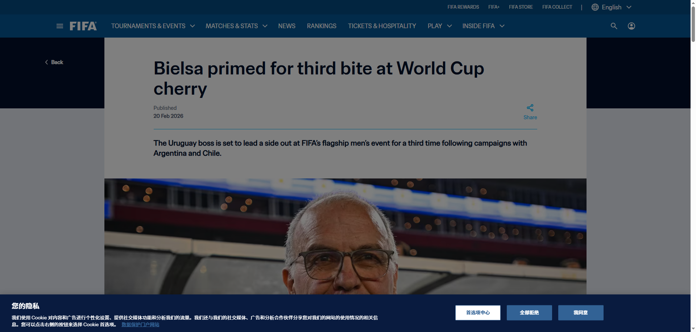

当教练失去了更衣室里最资深的声音的信任，战术就是纸上谈兵。

### 密码四：3个前锋打世界杯，一个惊世骇俗的自我阉割

乌拉圭的大名单里有23名球员。只有3个前锋：努涅斯、阿吉雷、比尼亚斯。在所有32支世界杯参赛队里，这是并列最少的。

更离谱的是：努涅斯自从2月份转会利雅得新月后，因为俱乐部外援注册名额调整，他近四个月没有踢过一场正式比赛。阿吉雷在墨西哥老虎队踢球。比尼亚斯在西乙的皇家奥维耶多。这不是世界杯级别的锋线。

贝尔萨拒绝征召苏亚雷斯。苏亚雷斯专门打过电话，说只要国家队需要，可以取消退役回来。贝尔萨无视了。他还拒绝了多名在五大联赛效力、数据尚可的攻击手。

只有3个前锋意味着什么？意味着贝尔萨在第70分钟之前不想换人也不能换人——因为替补席上没有牌。而努涅斯半场体能就见底这件事，早在他效力利物浦时期就不是秘密了。

### 密码五：提前宣布离任的"倒计时效应"

贝尔萨在世界杯前已经确认，无论结果如何，他将在世界杯后离开乌拉圭国家队。这个决定的后果远比想象中深远。

搜狐的深度文章用一个关键词概括了更衣室的心态："倒计时"。球员们知道——带着这个老头撑完四场比赛，一切就结束了。不是你死我活的战斗，是倒计时。乌拉圭足协不敢在世界杯前换帅，因为没有合适的接替人选。于是全队被锁定在一个"被困在一起"的状态里。

这恰好是2004年阿根廷剧本的精确复刻。当时贝尔萨在奥运会夺冠后辞职——球员和足协提前知道他要走。2026年的区别只在于：还没等到奥运会级别的成就，"结束"的倒计时就提前按下了。

## 第四章：他不是疯子

> **[图10]** 贝尔萨与瓜迪奥拉，2006年10月，罗萨里奥近郊 Máximo Paz。11小时的对谈改变了现代足球。来源：Infobae，2020年10月

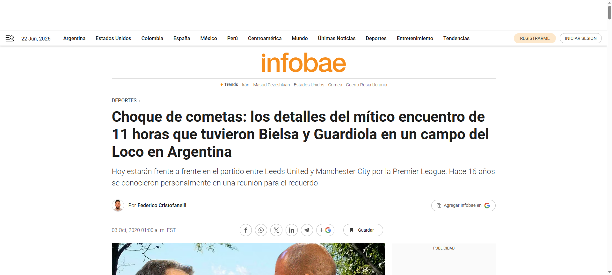

写到这里，如果你不熟悉贝尔萨，你大概会觉得这个老头是一个偏执的失败者。一个战术古董，一个管理灾难。

但他不是。

他是瓜迪奥拉在2006年专门飞到阿根廷罗萨里奥去求教的那个人。瓜迪奥拉的原话是："对我来说他是全世界最好的教练。"波切蒂诺说"他就像我的父亲"。西蒙尼说"他是一本公开的字典，而我只是一本刚开始书写的新书"。克洛普在英超赛后守在球员通道，只为了和他寒暄两句。齐达内专程去观摩他的训练课，见到他要脱帽。

这些人加起来，拿了超过40座联赛冠军和8座欧冠。他们没有任何必要恭维一个"失败者"。他们崇拜贝尔萨，因为贝尔萨发明了他们用来赢球的工具。

高位压迫的现代起源不是克洛普——是1990年代的贝尔萨实验室，在罗萨里奥的纽维尔老男孩。边锋拉开宽度，后卫人数+1原则，全队压迫时的区域轮转——这些后来被瓜迪奥拉的巴萨、克洛普的利物浦、西蒙尼的马竞发扬光大的战术构件，都在贝尔萨的3-3-1-3里面有原型。

他带了2000盘录像带去2002年世界杯。他在比赛前一晚独自走进球场，一步一步测量草坪的尺寸，因为他需要确认自己的阵型计算准确到米。他在训练场上往球鞋上画点，告诉球员"球应该接触这个位置"。These Football Times的传记文章记录了一个场景：贝尔萨在毕尔巴鄂执教时，有一次因为讨论战术而错过了自己的生日聚餐，他的妻子在餐厅等了他三个小时。

这才是困局最残酷的核心。

贝尔萨不是疯子。他只是一个把足球当成精确科学的人——而足球从来不是精确科学。他的伟大和他的失败来自同一个地方：不可动摇的信念。他的每一次崩塌，都是一次理想主义对现实主义的投降。而每一次投降之后，他都没有改变——因为他坚持认为，不是理念错了，是执行不够完美。

这不叫固执。这叫信仰。24年了，一个人能坚持同一种信仰这么久——你可以不同意他，但你没办法嘲笑他。

## 终章：末轮之赌

6月27日，乌拉圭对阵西班牙，阿克隆体育场。

H组现在的积分是：西班牙4分，乌拉圭和佛得角同积2分，沙特1分。

> **[图11]** H组积分形势（截至第二轮结束）。末轮乌拉圭必须击败西班牙才能确保出线。

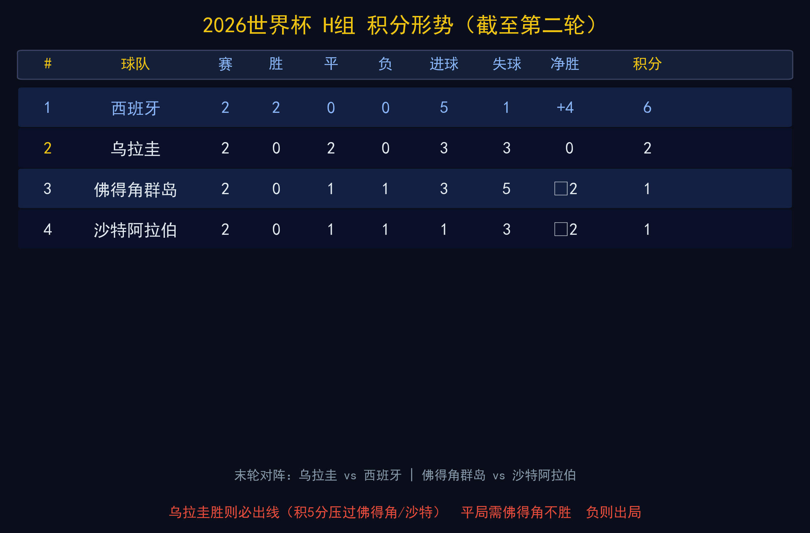

乌拉圭如果赢球，积分来到5分，稳稳出线。如果打平——3分，要看佛得角vs沙特的结果。如果输了——2分，大概率小组淘汰。

乌拉圭需要打赢西班牙。西班牙。那支刚刚在第一轮4比0血洗了沙特的西班牙。那支在第二轮和佛得角0比0的西班牙——是的，那支把佛得角整得死去活来的西班牙。

贝尔萨将带着一个只有3个前锋的阵容、一个四个月没踢比赛的中锋、一个在第61分钟送过空门的40岁门将、一个创造力核心可能带伤出场的10号位置——去面对路易斯·德拉富恩特手下那台运转精密的机器。

他说"第三场唯一的目标就是全力击败西班牙"——这是从赛后发布会上引出来的原话。

我相信他说的是真的。因为他从来没有说过假话。1998年到2026年，28年间，贝尔萨的每一次承诺都用行动兑现了——无论结果是胜利还是崩塌。他只是兑现的方式，和他自己预设的，不太一样。

乌拉圭能赢吗？

从数据上说不乐观。从历史上说不乐观。从贝尔萨28年大赛记录上说不乐观。但足球从来是反数据的。西班牙可以被佛得角逼平——那是一个真实发生过的事情——所以乌拉圭可以赢西班牙，也是一个真实存在可能的事情。

如果真的是那样——狂人就第一次从他的困局里走出来了。

如果没有——他的世界杯执教生涯将以三届大赛全部低于预期告终。7场比赛，3胜1平3负，7个进球，7个失球。这个世界公认的战术天才，在最大的舞台上，战绩将停留在五五开。

起立。踱步。蹲下。

47岁时的姿势。70岁时的姿势。时间拿走了他很多，唯独没拿走这个。

---

*我认识贝尔萨，是从2002年的阿根廷开始的。那一年他47岁，头发还是黑的，战术板上的3-3-1-3像一把新铸的刀。24年后，他70岁了，头发全白，走路比以前慢了一点，但那把刀还在他手里——只是刀身上多了些缺口。他不是足球世界里的赢家模板，但他是我见过对这项运动最诚实的人。*

*时间过得真快。但我还是希望他能赢。希望70岁的狂人，走出他的困局。*

---

*FIFA官方回顾文章、Squawka战术分析、SportsMole赛后报道、Sports Illustrated阵容前瞻、搜狐体育/绿茵数据馆深度特写、头条体育赛后分析、El País Uruguay三届世界杯对比特写、These Football Times智利足球风格长文、新浪体育贝尔萨战术史、SportSignals人物特写均有引用，特此致谢。*
